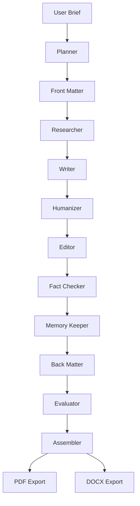
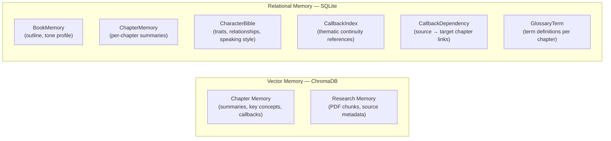
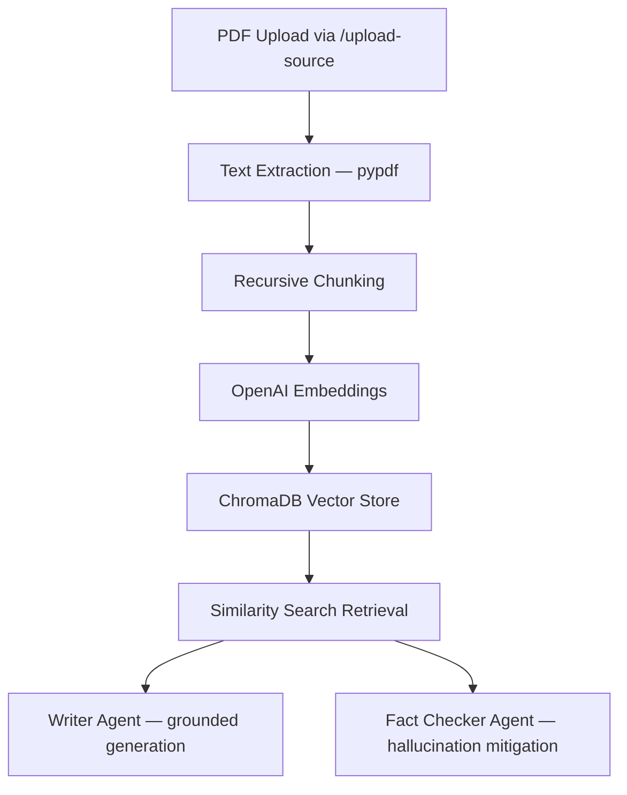
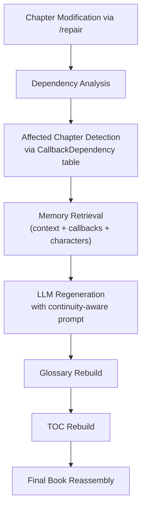

# AI Book Generator

A production-grade, multi-agent AI book generation platform that transforms a simple user brief into a fully structured, publication-ready book — complete with front matter, back matter, glossary, table of contents, and downloadable PDF/DOCX exports.

Built with **FastAPI**, **LangGraph**, **LangChain**, **ChromaDB**, **OpenAI**, and **LangSmith**.

---

## Table of Contents

- [Key Features](#key-features)
- [System Architecture](#system-architecture)
- [Agent Pipeline](#agent-pipeline)
- [Memory Architecture](#memory-architecture)
- [RAG Pipeline](#rag-pipeline)
- [Self-Healing Continuity System](#self-healing-continuity-system)
- [Evaluation Framework](#evaluation-framework)
- [Tech Stack](#tech-stack)
- [Project Structure](#project-structure)
- [Getting Started](#getting-started)
- [API Reference](#api-reference)
- [Design Decisions](#design-decisions)
- [Future Improvements](#future-improvements)

---

## Key Features

| Feature | Description |
|---|---|
| **Multi-Agent Orchestration** | 11 specialized AI agents orchestrated via a LangGraph DAG |
| **Retrieval-Augmented Generation** | Upload PDF research sources → chunked, embedded, and stored in ChromaDB for grounded writing |
| **Multi-Layer Memory** | Chapter memory, callback memory, and character bible persisted across chapters via ChromaDB + SQLite |
| **Self-Healing Continuity** | Modify any chapter → downstream dependencies are auto-detected and selectively regenerated |
| **Humanization Pipeline** | AI-tell detection, sentence rhythm variation, and hook generation to reduce robotic prose |
| **LLM-as-Judge Evaluation** | Every chapter is scored on tone fidelity, humanization, structure, factual grounding, and callback consistency |
| **Publication-Ready Export** | Formatted PDF (ReportLab) and DOCX (python-docx) with TOC, glossary, and section-aware layout |
| **Observability** | Prompt logging, cost tracking, and full LangSmith tracing for every agent call |

---

## System Architecture

The platform passes a shared `BookState` through a sequence of specialized agents, each contributing to the final book. The graph is compiled and executed by LangGraph.



---

## Agent Pipeline

Each agent is a LangGraph node (`graph/nodes/`) that receives the shared `BookState`, performs its task using a structured LLM call, and updates the state.

| # | Agent | Responsibility | Key Implementation Details |
|---|---|---|---|
| 1 | **Planner** | Generates book outline, chapter sequencing, pacing | Structured output → `PlannerOutput` model |
| 2 | **Front Matter** | Generates preface, foreword, dedication, TOC | Structured output → `FrontMatterOutput` model |
| 3 | **Researcher** | Ingests uploaded PDFs, chunks text, stores embeddings in ChromaDB | Uses `retrieval_service` + `chunking_service` |
| 4 | **Writer** | Generates long-form chapter content with full memory context | Integrates research context, character memory, callback candidates, and tone profile |
| 5 | **Humanizer** | Reduces AI prose patterns, improves rhythm, adds hooks | Runs AI-tell detector → rhythm variation → hook generation pipeline |
| 6 | **Editor** | Clarity improvements, structural cleanup, readability pass | Structured output → `EditorOutput` model |
| 7 | **Fact Checker** | Evidence-aware hallucination mitigation using retrieved research | Cross-references claims against RAG context |
| 8 | **Memory Keeper** | Persists chapter summaries, callbacks, glossary terms, and character data to SQLite | Commits to `ChapterMemory`, `CallbackIndex`, `GlossaryTerm`, `CharacterBible` tables |
| 9 | **Back Matter** | Generates glossary, bibliography, appendix, index | Structured output → `BackMatterOutput` model |
| 10 | **Evaluator** | Scores each chapter using LLM-as-judge architecture | Evaluates tone fidelity, humanization, structure, grounding, callbacks |
| 11 | **Assembler** | Compiles front matter + chapters + back matter into `final_book` | Produces the final assembled book string |

---

## Memory Architecture

The platform implements a multi-layered memory system to maintain coherence across chapters:



**Run Isolation**: Each generation run gets a unique `run_id`. Both ChromaDB collections and SQLite records are scoped by `run_id` to prevent cross-run contamination.

---

## RAG Pipeline

Users can upload PDF research documents that are ingested into the retrieval pipeline to ground the generated content in factual sources.



---

## Self-Healing Continuity System

When a chapter is modified post-generation, the platform automatically detects and regenerates all downstream dependent chapters to preserve narrative continuity.



---

## Evaluation Framework

The evaluator agent uses an **LLM-as-judge** architecture to score every generated chapter across five dimensions:

| Dimension | What It Measures |
|---|---|
| Tone Fidelity | Adherence to the requested writing tone |
| Humanization Quality | Absence of robotic AI prose patterns |
| Structural Quality | Logical flow, section organization, pacing |
| Factual Grounding | Claims supported by research evidence |
| Callback Consistency | Proper use of thematic callbacks across chapters |

Each evaluation produces structured output with scores, strengths, weaknesses, and issue reports.

---

## Tech Stack

| Layer | Technology | Purpose |
|---|---|---|
| API Server | FastAPI + Uvicorn | REST API with automatic OpenAPI docs |
| Agent Orchestration | LangGraph | Stateful DAG execution for multi-agent workflows |
| LLM Integration | LangChain + OpenAI | Structured output generation, prompt templating |
| Vector Store | ChromaDB + OpenAI Embeddings | Semantic retrieval for RAG and chapter memory |
| Relational DB | SQLite + SQLAlchemy | Persistent storage for character bible, callbacks, glossary |
| PDF Export | ReportLab | Publication-formatted PDF generation |
| DOCX Export | python-docx | Word document generation with formatting |
| Observability | LangSmith | End-to-end tracing, prompt tracking, latency analysis |
| Configuration | Pydantic Settings + python-dotenv | Type-safe environment configuration |

---

## Project Structure

```
AI-Book-Generator/
├── main.py                          # FastAPI application entry point
├── requirements.txt                 # Python dependencies
├── architecture.md                  # Detailed architecture documentation
├── .env                             # Environment variables (API keys)
├── .gitignore
│
├── api/
│   └── routes.py                    # All REST endpoints (/generate, /repair, /export, /upload-source)
│
├── graph/
│   ├── state.py                     # BookState TypedDict — shared state schema
│   ├── workflow.py                  # LangGraph DAG construction and compilation
│   └── nodes/                       # Individual agent node implementations
│       ├── planner.py
│       ├── frontmatter.py
│       ├── researcher.py
│       ├── writer.py               # Memory-integrated long-form chapter generation
│       ├── humanizer.py            # AI-tell detection + rhythm variation + hooks
│       ├── editor.py
│       ├── fact_checker.py
│       ├── memory_keeper.py        # SQLite persistence for chapter/callback/glossary data
│       ├── backmatter.py
│       ├── evaluator.py            # LLM-as-judge scoring
│       └── assembler.py            # Final book compilation
│
├── services/
│   ├── llm_service.py               # LLM client initialization
│   ├── retrieval_service.py         # ChromaDB storage and retrieval operations
│   ├── research_service.py          # Research context retrieval
│   ├── chunking_service.py          # Text chunking for embeddings
│   ├── document_parser_service.py   # PDF text extraction
│   ├── source_ingestion_service.py  # End-to-end PDF → ChromaDB ingestion
│   ├── character_service.py         # Character bible CRUD operations
│   ├── evaluation_service.py        # Chapter evaluation logic
│   ├── repair_service.py            # Self-healing continuity repair workflow
│   ├── chapter_regeneration_service.py  # Regeneration plan preparation
│   ├── callback_dependency_service.py   # Downstream dependency resolution
│   ├── llm_regeneration_service.py  # LLM-powered chapter regeneration
│   ├── ai_tell_detector.py          # Detects robotic AI prose patterns
│   ├── style_variation_service.py   # Sentence rhythm variation
│   ├── hook_generator_service.py    # Opening hook generation
│   ├── glossary_service.py          # Glossary rebuild from chapters
│   ├── toc_service.py               # Table of contents rebuild
│   ├── pdf_service.py               # ReportLab PDF generation
│   ├── docx_service.py              # python-docx DOCX generation
│   ├── export_utils.py              # Shared export utilities
│   └── runtime_store.py             # In-memory run state cache
│
├── models/                          # Pydantic models for structured LLM output
│   ├── dto.py                       # BookRequest API input model
│   ├── planner_models.py
│   ├── chapter_models.py
│   ├── frontmatter_models.py
│   ├── backmatter_models.py
│   ├── humanizer_models.py
│   ├── editor_models.py
│   ├── fact_checker_models.py
│   ├── evaluation_models.py
│   ├── memory_models.py
│   ├── research_models.py
│   └── repair_models.py
│
├── prompts/                         # LLM prompt templates (Python strings)
│   ├── planner_prompt.py
│   ├── writer_prompt.py
│   ├── humanizer_prompt.py
│   ├── editor_prompt.py
│   ├── fact_checker_prompt.py
│   ├── evaluator_prompt.py
│   ├── frontmatter_prompt.py
│   ├── backmatter_prompt.py
│   ├── regeneration_prompt.py
│   └── tone_profiles.py            # Tone preset definitions
│
├── prompts_dossier/                 # Detailed prompt engineering documentation
│   ├── planner_prompt.md
│   ├── writer_prompt.md
│   ├── humanizer_prompt.md
│   ├── fact_checker_prompt.md
│   ├── evaluator_prompt.md
│   ├── researcher_prompt.md
│   └── regeneration_prompt.md
│
├── memory/
│   ├── database.py                  # SQLAlchemy engine and session factory
│   ├── init_db.py                   # Database initialization (create tables)
│   ├── schemas.py                   # SQLAlchemy ORM models (6 tables)
│   └── vector_store.py             # ChromaDB collection management (run-isolated)
│
├── core/
│   └── config.py                    # Pydantic Settings for environment config
│
├── observability/
│   └── monitor.py                   # Prompt logging and cost tracking (JSONL)
│
├── outputs/                         # Generated PDF/DOCX files
├── uploaded_sources/                # Uploaded research PDFs
└── chroma_db/                       # ChromaDB persistence directory
```

---

## Getting Started

### Prerequisites

- Python 3.11+
- OpenAI API key
- LangSmith API key (optional, for tracing)

### 1. Clone the Repository

```bash
git clone https://github.com/thummar05/AI-Book-Generator.git
cd AI-Book-Generator
```

### 2. Create a Virtual Environment

```bash
python -m venv .venv
source .venv/bin/activate        # Linux / macOS
# .venv\Scripts\activate         # Windows
```

### 3. Install Dependencies

```bash
pip install -r requirements.txt
```

### 4. Configure Environment Variables

Create a `.env` file in the project root:

```env
OPENAI_API_KEY=sk-your-openai-api-key

# LangSmith (optional — enables tracing)
LANGSMITH_TRACING=true
LANGSMITH_ENDPOINT=https://api.smith.langchain.com
LANGSMITH_API_KEY=lsv2_your-langsmith-key
LANGSMITH_PROJECT="ai-book-generator"
```

### 5. Run the Application

```bash
uvicorn main:app --reload
```

The server starts at `http://127.0.0.1:8000`. Interactive API docs are available at:

- **Swagger UI**: [http://127.0.0.1:8000/docs](http://127.0.0.1:8000/docs)
- **ReDoc**: [http://127.0.0.1:8000/redoc](http://127.0.0.1:8000/redoc)

---

## API Reference

### `POST /generate` — Generate a Book

Triggers the full 11-agent pipeline to generate a complete book.

**Request Body:**

```json
{
  "topic": "The History of Artificial Intelligence",
  "tone": "academic",
  "target_audience": "university students",
  "chapters": 5
}
```

**Response:**

```json
{
  "run_id": "a1b2c3d4-...",
  "outline": {
    "book_title": "...",
    "book_summary": "...",
    "chapters": [...]
  },
  "book": "... (assembled book text) ...",
  "evaluations": [
    {
      "chapter": "Chapter Title",
      "evaluation": { "tone_score": 8, "strengths": [...], "weaknesses": [...] }
    }
  ]
}
```

---

### `POST /upload-source` — Upload Research PDF

Uploads a PDF document into the RAG pipeline for grounded generation.

**Request:** `multipart/form-data`

| Field | Type | Description |
|---|---|---|
| `topic` | string | Topic/label for the research source |
| `file` | file | PDF file to upload |

---

### `POST /repair/{run_id}` — Self-Healing Repair

Modifies a chapter and auto-regenerates all downstream dependent chapters.

**Request Body:**

```json
{
  "changed_chapter": 2,
  "new_content": "Updated chapter content..."
}
```

**Response:**

```json
{
  "message": "Repair completed",
  "affected_chapters": [2, 3, 5],
  "updated_book": "... (reassembled book text) ..."
}
```

---

### `POST /export/pdf/{run_id}` — Export as PDF

Returns the generated book as a formatted PDF file.

---

### `POST /export/docx/{run_id}` — Export as DOCX

Returns the generated book as a formatted Word document.

---

### `GET /health` — Health Check

```json
{ "status": "ok" }
```

---

## Design Decisions

| Decision | Rationale |
|---|---|
| **LangGraph over simple chains** | Needed a stateful DAG with deterministic execution order across 11 agents — LangGraph provides compiled graph execution with shared state |
| **Structured output on every agent** | Each LLM call uses `with_structured_output()` against Pydantic models, ensuring type-safe, parseable responses |
| **Run-scoped ChromaDB collections** | Each `run_id` gets its own Chroma collection + persistence directory to prevent cross-run memory contamination |
| **SQLite for relational memory** | Character bible, callback dependencies, and glossary terms require relational queries (e.g., "find all callbacks from chapter 2 → chapter 5") that vector stores cannot serve |
| **Dual memory layers** | ChromaDB handles semantic similarity retrieval; SQLite handles structured lookups — together they provide both fuzzy and exact memory access |
| **Post-generation self-healing** | Rather than requiring full regeneration on edits, the dependency graph enables surgical regeneration of only affected chapters |
| **Humanizer as a separate agent** | Separating humanization from writing lets the writer focus on content while the humanizer applies style post-processing (AI-tell detection, rhythm, hooks) |
| **In-memory runtime store** | Run state is cached in `RUN_CACHE` dict for fast access during repair/export — suitable for single-server deployment |

---

## Future Improvements

- Semantic dependency graphs for finer-grained repair targeting
- Multi-model routing (e.g., GPT-4o for writing, GPT-4o-mini for evaluation)
- Async generation pipeline with WebSocket progress streaming
- Persistent run storage (PostgreSQL/Redis) for multi-server deployment
- Automated prompt optimization via evaluation feedback loops
- Collaborative editing workflows with version tracking

---
