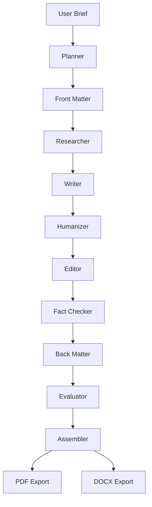
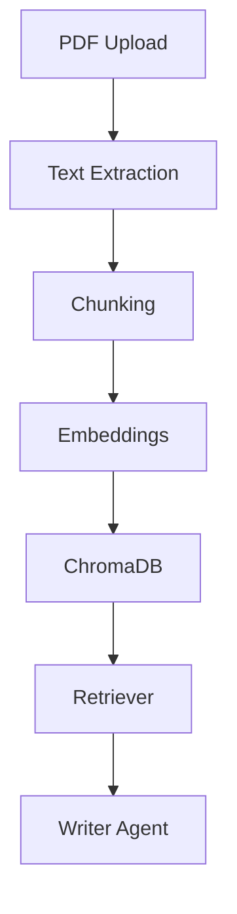
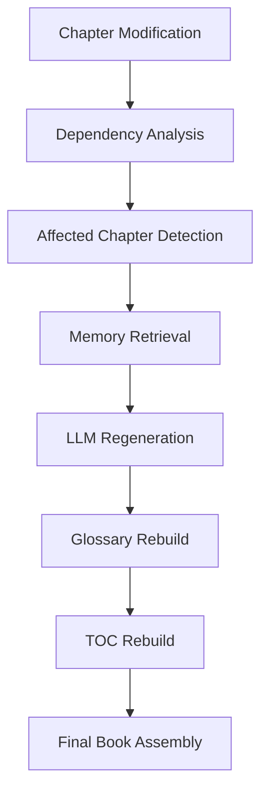

# System Architecture

## Overview

The platform is a multi-agent AI book generation system built using:
- FastAPI
- LangGraph
- LangChain
- ChromaDB
- OpenAI models
- LangSmith tracing

The system supports:
- long-form book generation
- retrieval-augmented generation (RAG)
- continuity-aware memory
- self-healing chapter regeneration
- evaluation pipelines
- PDF/DOCX export workflows

---

# High-Level Workflow

---

# Agent Pipeline

## Planner Agent

Responsible for:
- book structure
- chapter sequencing
- summaries
- pacing foundation

Outputs:
- outline metadata
- chapter planning structure

---

## Researcher Agent

Responsible for:
- document ingestion
- chunking
- embeddings
- vector storage
- retrieval preparation

Technologies:
- ChromaDB
- embedding models
- recursive chunking

---

## Writer Agent

Responsible for:
- long-form chapter generation
- memory integration
- callback usage
- grounded writing

Inputs:
- retrieval context
- character memory
- callback memory
- tone guidance

---

## Humanizer Agent

Responsible for:
- reducing AI prose patterns
- improving rhythm
- improving conversational flow
- hook generation

Additional systems:
- AI tell detection
- sentence cadence variation

---

## Editor Agent

Responsible for:
- clarity improvements
- structure cleanup
- readability enhancement

---

## Fact Checker Agent

Responsible for:
- hallucination reduction
- evidence-aware verification
- factual softening
- grounded rewriting

Inputs:
- retrieved evidence
- research context

---

## Evaluator Agent

Responsible for:
- tone fidelity scoring
- humanization scoring
- structural evaluation
- callback consistency evaluation

Implements:
- LLM-as-judge architecture

---

## Assembler Agent

Responsible for:
- final book assembly
- publication formatting
- final structured output generation

---

# Memory Architecture

The system implements multiple memory layers:

## Chapter Memory
Stores:
- prior chapter summaries
- continuity context

---

## Callback Memory
Tracks:
- recurring concepts
- callback references
- thematic continuity

---

## Character Memory
Tracks:
- recurring entities
- character continuity
- narrative consistency

---

# Retrieval-Augmented Generation (RAG)

The platform uses RAG to improve factual grounding.

## Workflow

---

# Self-Healing Continuity System

The platform supports selective regeneration after chapter modifications.

## Workflow

---

# Evaluation Architecture

The platform uses an LLM-as-judge evaluation layer.

Evaluation dimensions include:
- tone fidelity
- humanization quality
- structural quality
- factual grounding
- callback consistency

Outputs:
- structured quality scores
- strengths/weaknesses
- issue reports

---

# Export System

The system supports:
- PDF export
- DOCX export

Features include:
- formatted chapters
- glossary rendering
- TOC rendering
- publication formatting
- section-aware layout

---

# Observability

The system integrates:
- LangSmith tracing
- LangGraph execution tracing
- model execution analytics

Tracked metadata includes:
- prompts
- execution flows
- model calls
- token usage
- latency

---

# Key Architectural Features

## Multi-Agent Orchestration
Implemented using LangGraph.

---

## Retrieval-Augmented Generation
Implemented using ChromaDB and embeddings.

---

## Continuity-Aware Regeneration
Supports selective downstream repair.

---

## Self-Healing Workflow
Automatically rebuilds:
- glossary
- table of contents
- final book assembly

after chapter modifications.

---

## LLM-as-Judge Evaluation
Provides structured quality assessment.

---

# Technology Stack

| Component | Technology |
|---|---|
| API Layer | FastAPI |
| Orchestration | LangGraph |
| Prompt Pipelines | LangChain |
| Vector Store | ChromaDB |
| LLM Provider | OpenAI |
| Tracing | LangSmith |
| Export System | ReportLab / python-docx |

---